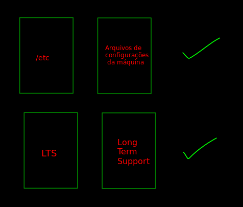
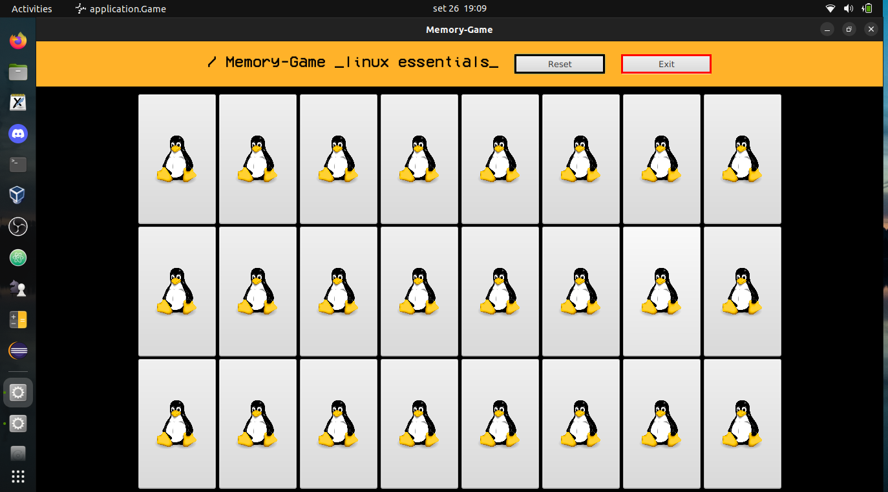

# Memory Game

Memory game to learn linux.

- Memory-game Linux Essentials.
- Vídeo do projeto: [link](https://youtu.be/mycvCAibvZo)
- Rabiscos e ideia: [link](https://github.com/pauloh-alc/linux-memory-game/blob/main/rabiscos-e-ideia-jogo-da-memoria.pdf)


## About the Memory Game

This is one of the most famous memory games and one of the most fun as well. In it, a certain number of cards are positioned so that the part with the design is facing downwards. 

In each turn the player must choose two cards and turn them over. If they form a pair, they are removed from the game. Otherwise, they are turned over again. This process must be repeated until all cards are removed.

## Match example



## Installation

1. Clone this repository:
```sh
git clone https://github.com/pauloh-alc/memory-game-linux.git
```

2. Run the code in some IDE. You will need JavaFX, prefer JavaFX 11+. Make your settings too. Follow the link below with the step by step.

- Getting Started with JavaFX: [link](https://openjfx.io/openjfx-docs/)


## Version Control System

- Git

I tried to do the commits of this project in a well organized way. With that, apply some tips for a better commit message.

Follow the model: [commit-style](https://commit.style/)

- Some screenshots of commits 


## Code working




## License

[MIT](https://github.com/pauloh-alc/linux-memory-game/blob/main/LICENSE)

## Author

Paulo Alencar: [linkedin](https://www.linkedin.com/in/paulo-alencar-006357225/)
